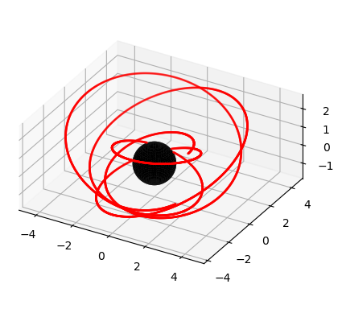
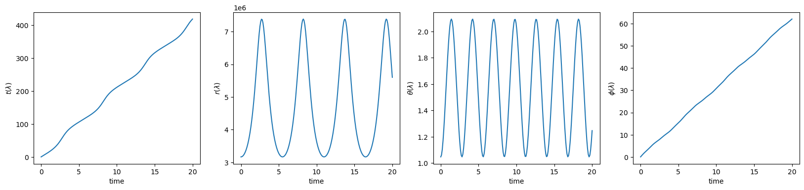
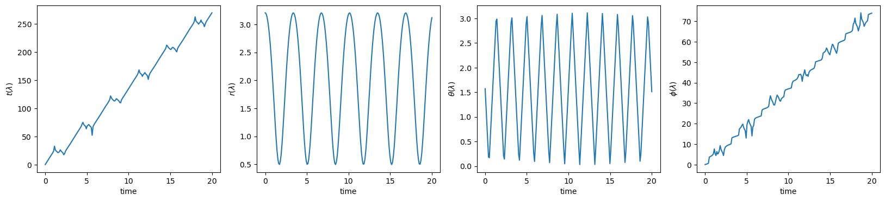

# Getting Started

Bound orbits in kerrgeopy are parametrized by the following:

$a$ - dimensionless spin of the primary
<br>
$p$ - orbital semilatus rectum
<br>
$e$ - orbital eccentricity
<br>
$x$ - cosine of the orbital inclination
<br>

Retrograde orbits are represented using negative values for $a$ or for $x$. First, define an orbit by passing in these four parameters


```python
import kerrgeopy as kg
from math import cos, pi

orbit = kg.BoundOrbit(0.998,3,0.6,cos(pi/4))
```

We can plot the orbit from $\lambda = 0$ to $\lambda = 10$ using the `plot()` method


```python
fig, ax = orbit.plot(0,10)
```


    

    


Use the `animate()` method to create an animation of the orbit and save it as an mp4 file.


```python
orbit.animate("animation1.mp4")
```


https://github.com/syp2001/KerrGeoPy/assets/38138782/e8a265f2-550c-4a5e-9383-befbac5e7004


The `animate()` method also provides parameters to change the length of the orbital tail and to change the visibility of the axes


```python
orbit.animate("animation2.mp4", grid=False, axes=False, tail="short")
```


https://github.com/syp2001/KerrGeoPy/assets/38138782/25622db9-f144-4ba5-b9a9-b099f3ddb683


Next, we can compute the time, radial, polar and azimuthal components of the trajectory as a function of Mino time using the `trajectory()` method


```python
t, r, theta, phi = orbit.trajectory()
```


```python
import numpy as np
import matplotlib.pyplot as plt

time = np.linspace(0,20,200)

plt.figure(figsize=(20,4))

plt.subplot(1,4,1)
plt.plot(time, t(time))
plt.xlabel("time")
plt.ylabel(r"$t(\lambda)$")

plt.subplot(1,4,2)
plt.plot(time, r(time))
plt.xlabel("time")
plt.ylabel("$r(\lambda)$")

plt.subplot(1,4,3)
plt.plot(time, theta(time))
plt.xlabel("time")
plt.ylabel(r"$\theta(\lambda)$")

plt.subplot(1,4,4)
plt.plot(time, phi(time))
plt.xlabel("time")
plt.ylabel(r"$\phi(\lambda)$")
```

    

    


## Orbital Properties

We can compute the dimensionless energy, angular momentum and carter constant using the `constants_of_motion()` method. We can also compute the frequencies of motion in Mino time using the `mino_frequencies()` method and in Boyer-Lindquist time using the `observer_frequencies()` method.


```python
from IPython.display import display, Math

E, L, Q = orbit.constants_of_motion()

upsilon_r, upsilon_theta, upsilon_phi, gamma = orbit.mino_frequencies()

omega_r, omega_theta, omega_phi = orbit.observer_frequencies()


display(Math(fr"a = {orbit.a} \quad p = {orbit.p} \quad e = {orbit.e} \quad x = {orbit.x}"))

display(Math(fr"E = {E:.3f} \quad L = {L:.3f} \quad Q = {Q:.3f}"))

display(Math(fr"""\Upsilon_r = {upsilon_r:.3f} \quad 
             \Upsilon_\theta = {upsilon_theta:.3f} \quad 
             \Upsilon_\phi = {upsilon_phi:.3f} \quad 
             \Gamma = {gamma:.3f}"""))

display(Math(fr"""\Omega_r = {omega_r:.3f} \quad
            \Omega_\theta = {omega_theta:.3f} \quad
            \Omega_\phi = {omega_phi:.3f}"""))
```


$\displaystyle a = 0.999 \quad p = 3 \quad e = 0.4 \quad x = 0.8660254037844387$


$\displaystyle E = 0.877 \quad L = 1.903 \quad Q = 1.265$


$\displaystyle \Upsilon_r = 1.145 \quad \Upsilon_\theta = 2.243 \quad \Upsilon_\phi = 3.118 \quad \Gamma = 20.531$


$\displaystyle \Omega_r = 0.056 \quad \Omega_\theta = 0.109 \quad \Omega_\phi = 0.152$


## Units

If $M$ and $\mu$ are defined, then kerrgeopy can also compute constants and frequencies in physical units.


```python
orbit = kg.Orbit(0.999,3,0.4,cos(pi/6), M=1e6, mu=10)
```


```python
from IPython.display import display, Math

E, L, Q = orbit.constants_of_motion(units="mks")

upsilon_r, upsilon_theta, upsilon_phi, gamma = orbit.mino_frequencies(units="mks")

omega_r, omega_theta, omega_phi = orbit.observer_frequencies(units="mHz")


display(Math(fr"M = {orbit.M:g} \text{{ M}}_\odot \quad \mu = {orbit.mu} \text{{ M}}_\odot"))

display(Math(fr"a = {orbit.a} \quad p = {orbit.p} \quad e = {orbit.e} \quad x = {orbit.x}"))

display(Math(fr"""E = {E:.3e} \text{{ J}} 
             \quad L = {L:.3e} \text{{ kg m}}^2 \text{{s}}^{{-1}} 
             \quad Q = {Q:.3e} \text{{ kg}}^2 \text{{m}}^4 \text{{s}}^{{-2}}"""))

display(Math(fr"""\Upsilon_r = {upsilon_r:.3f} \text{{ s}} \quad 
             \Upsilon_\theta = {upsilon_theta:.3f} \text{{ s}} \quad 
             \Upsilon_\phi = {upsilon_phi:.3f} \text{{ s}} \quad 
             \Gamma = {gamma:.3f} \text{{ s}}^2"""))

display(Math(fr"""\Omega_r = {omega_r:.3f} \text{{ mHz}} \quad
            \Omega_\theta = {omega_theta:.3f} \text{{ mHz}}\quad
            \Omega_\phi = {omega_phi:.3f} \text{{ mHz}}"""))
```


$\displaystyle a = 0.999 \quad p = 3 \quad e = 0.4 \quad x = 0.8660254037844387$


$\displaystyle E = 1.568e+48 \text{ J} \quad L = 3.332e+79 \text{ kg m}^2 \text{s}^{-1} \quad Q = 3.876e+158 \text{ kg}^2 \text{m}^4 \text{s}^{-2}$


$\displaystyle \Upsilon_r = 5.638 \text{ s} \quad \Upsilon_\theta = 11.049 \text{ s} \quad \Upsilon_\phi = 15.358 \text{ s} \quad \Gamma = 498.078 \text{ s}^2$


$\displaystyle \Omega_r = 11.319 \text{ mHz} \quad \Omega_\theta = 22.183 \text{ mHz}\quad \Omega_\phi = 30.835 \text{ mHz}$


## Plunging Orbits

Plunging orbits are parametrized using the spin parameter and the three constants of motion.

$a$ - dimensionless spin of the primary
<br>
$\mathcal{E}$ - energy
<br>
$\mathcal{L}$ - angular momentum
<br>
$Q$ - carter constant
<br>

Construct a plunging orbit by passing in these four parameters.


```python
orbit = kg.PlungingOrbit(0.9, 0.94, 0.1, 12)
```

As before, the components of the trajectory can be computed using the `trajectory()` method


```python
t, r, theta, phi = orbit.trajectory()
```


```python
import numpy as np
import matplotlib.pyplot as plt

time = np.linspace(0,20,200)

plt.figure(figsize=(20,4))

plt.subplot(1,4,1)
plt.plot(time, t(time))
plt.xlabel("time")
plt.ylabel(r"$t(\lambda)$")

plt.subplot(1,4,2)
plt.plot(time, r(time))
plt.xlabel("time")
plt.ylabel("$r(\lambda)$")

plt.subplot(1,4,3)
plt.plot(time, theta(time))
plt.xlabel("time")
plt.ylabel(r"$\theta(\lambda)$")

plt.subplot(1,4,4)
plt.plot(time, phi(time))
plt.xlabel("time")
plt.ylabel(r"$\phi(\lambda)$")
```


    Text(0, 0.5, '$\\phi(\\lambda)$')


    

    


## Separatrix

kerrgeopy also provides a method for computing the value of $p$ at the separatrix given values for $a$, $e$ and $x$.


```python
kg.separatrix(0.5,0.5,0.5)
```


    5.860560368032176


For better performance, kerrgeopy also provides a method which constructs a faster separatrix function given a value of $a$ by interpolating from a grid of $e$ and $x$ values. This method is slightly less accurate but runs around 100 times faster.


```python
fast_separatrix = kg.fast_separatrix(a=0.5)
fast_separatrix(0.5,0.5)
```


    5.86056037


```python
%timeit kg.separatrix(0.5,0.5,0.5)
```

    86.7 µs ± 200 ns per loop (mean ± std. dev. of 7 runs, 10,000 loops each)


```python
%timeit fast_separatrix(0.5,0.5)
```

    947 ns ± 5.48 ns per loop (mean ± std. dev. of 7 runs, 1,000,000 loops each)

