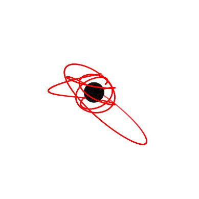

.. KerrGeoPy documentation master file, created by
   sphinx-quickstart on Wed Jun 21 09:39:10 2023.
   You can adapt this file completely to your liking, but it should at least
   contain the root `toctree` directive.

Overview
========

**Kerrgeopy** is a python library for computing geodesics in Kerr spacetime. It is intended for use in computing orbital trajectories for extreme-mass-ratio inspirals (EMRIs). 
It implements the analytical solutions for plunging orbits from `Dyson and van de Meent <https://arxiv.org/abs/2302.03704>`_, as well as solutions for non-plunging orbits from `Fujita and Hikida <https://arxiv.org/abs/0906.1420>`_. 
The library also provides a set of methods for computing constants of motion and orbital frequencies, and can generate plots and animations like those shown below.

.. note::

   This project is under active development. 

.. _Installation:

Installation
------------
Install the latest version of kerrgeopy using pip

.. code-block:: bash

   pip install kerrgeopy

See `Getting Started <notebooks/Tutorial.html>`_ for basic usage. See the `API Reference`_ below or the `Modules <_autosummary/kerrgeopy.html>`_ page for a complete list of classes and methods.

.. toctree::
   :maxdepth: 2
   :caption: Tutorials

   notebooks/Tutorial
   notebooks/Orbital Properties
   notebooks/Trajectory
   notebooks/Graphics
   
.. _API Reference:

API Reference
-------------

.. toctree::
   :maxdepth: 1
   :caption: API Reference
   :hidden:

   Full List of Modules <https://kerrgeopy.readthedocs.io/en/latest/_autosummary/kerrgeopy.html>

.. autosummary::
   :toctree: _autosummary
   :template: custom-module-template.rst
   :recursive:
   
   ~kerrgeopy.stable_orbit.StableOrbit
   ~kerrgeopy.plunging_orbit.PlungingOrbit
   ~kerrgeopy.orbit.Orbit
   ~kerrgeopy.spacetime.KerrSpacetime
   ~kerrgeopy.constants
   ~kerrgeopy.frequencies
   ~kerrgeopy.units

Indices and tables
==================

* :ref:`genindex`
* :ref:`modindex`
* :ref:`search`
